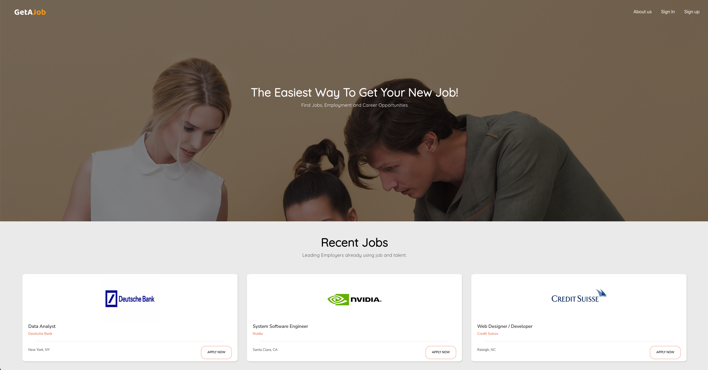
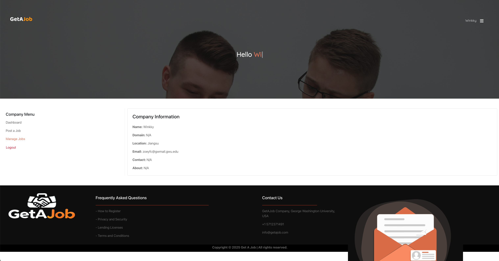

# 6210Capstone Job Portal

An interactive, full-stack web portal where **job seekers** can build and refine their resumes, browse and apply to openings, track applications, and access interview prep; and **employers** can post jobs, review applicants, and manage listings. This project combines a MERN-stack backend with a Python/Flask microservice for advanced resume refinement.

---

## 📸 Screenshots

### Landing Page  
  
  
  

### Candidate Dashboard  
  

### Resume Refinement  
  

### Interview Preparation  
  

### Application Tracking  
  

### Company Dashboard & Job Management  
  
  
  

---

## 🛠️ Tech Stack

- **Frontend:** React.js, Redux, React Router, Bootstrap  
- **Backend:** Node.js, Express.js, MongoDB (Mongoose)  
- **Microservice:** Python 3 + Flask for Resume Refinement  
- **Authentication:** JWT  
- **Styling:** SCSS / CSS Modules  

---

## 🚀 Getting Started

### Prerequisites
- Node.js 14+ & npm  
- Python 3.8+ & pip  
- MongoDB running locally or remotely  

### Initiation

1. Clone the repo  
```bash
git clone https://github.com/FeichenYu2001/6210Capstone.git
cd 6210Capstone

2. Install dependencies
bash
Copy
Edit
# Frontend (project root)
npm install

# Express.js API
cd mongodb
npm install
cd ..

# Flask microservice
pip install -r requirements.txt


3. Configure environment
Ensure MongoDB is accessible at mongodb://localhost:27017/6210capstone.

Adjust ports in package.json proxy and in app.py if needed.


4. Run the servers
bash
Copy
Edit
# Start the Express API (port 1234)
cd mongodb
npm start

# In a new terminal, start the React app (port 3000)
cd ..
npm start

# In another terminal, start the Flask service (port 5000)
python app.py